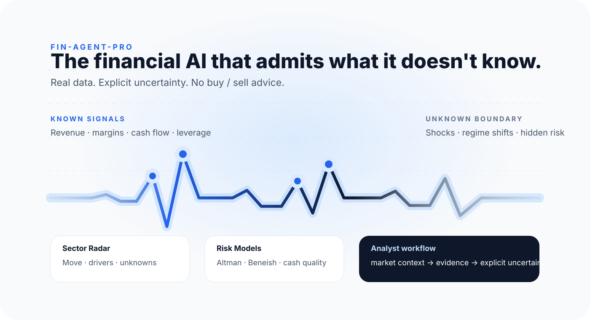
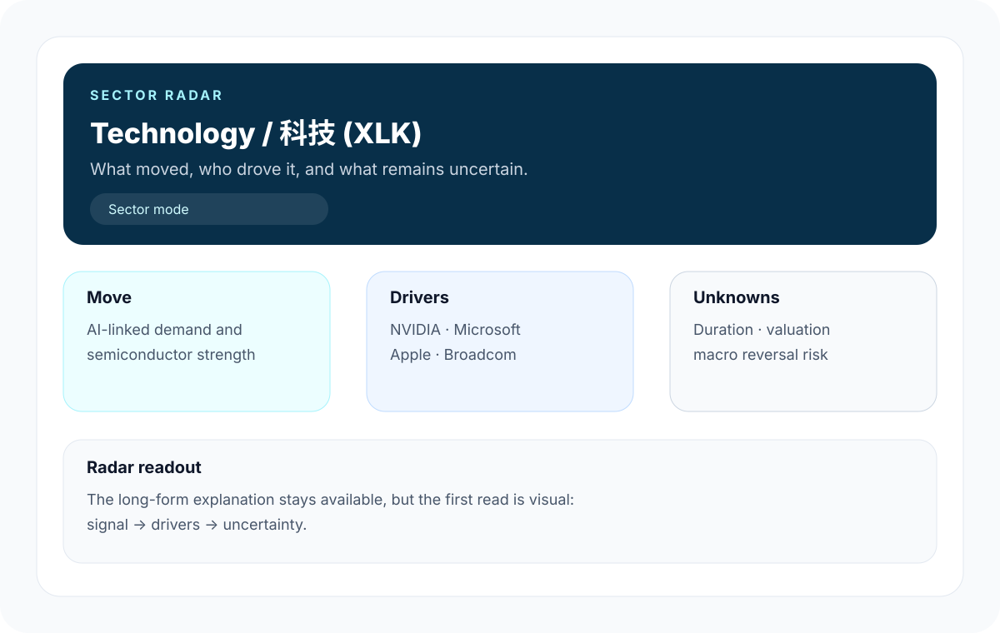
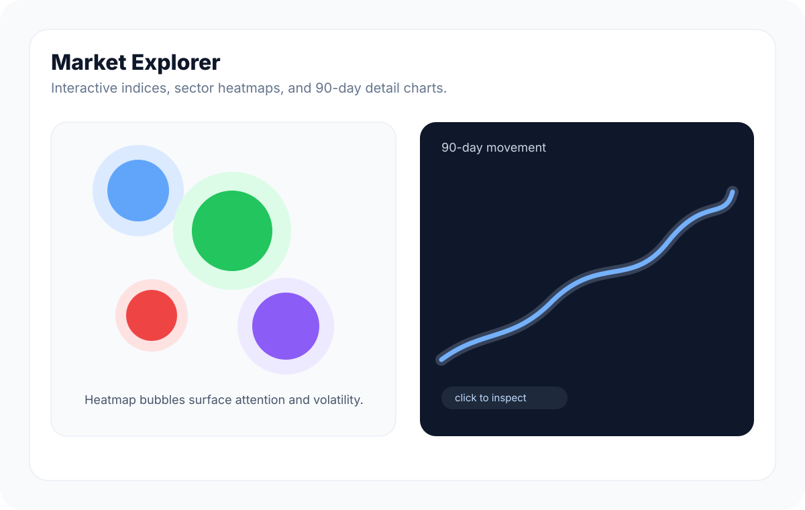
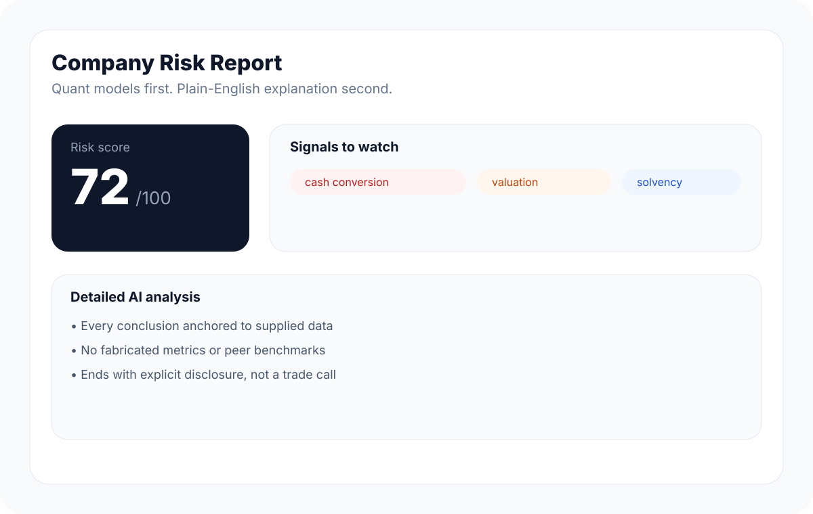
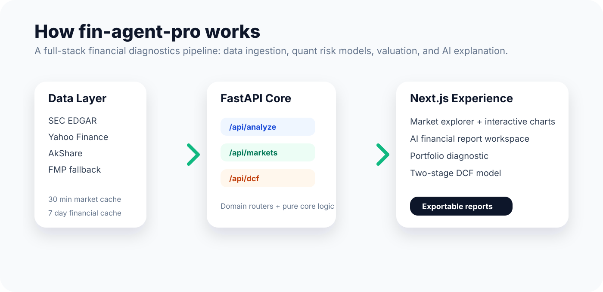

# fin-agent-pro

<p align="right">
  <a href="./README.md">English</a> ·
  <a href="./README.zh-CN.md">中文</a>
</p>

**The financial AI that admits what it doesn't know.**

`fin-agent-pro` is a full-stack financial diagnostics platform for US equities, China A-shares, and Hong Kong stocks. It is built for retail investors who want **honest financial analysis grounded in real data, explicit uncertainty, and zero buy/sell advice**.

It combines public-market data, quantitative risk models, an interactive market explorer, sector-level AI analysis, a two-stage DCF model, portfolio diagnostics, and LLM-generated reports — while keeping a bright line between what the data supports and what remains unknown.



<p align="center">
  <a href="https://github.com/Maul-LSH/fin-agent-pro"></a>
  <a href="https://nextjs.org/"></a>
  <a href="https://fastapi.tiangolo.com/"></a>
  <a href="https://www.python.org/"></a>
  <a href="https://opensource.org/licenses/MIT"></a>
  <a href="https://github.com/Maul-LSH/fin-agent-pro"></a>
  <a href="https://opensource.org/licenses/MIT"></a>
</p>

## Product Previews

| Sector Radar | Market Explorer |
| --- | --- |
|  |  |



## Why This Exists

Most retail finance tools either show raw ratios without context or ask an AI model to summarize incomplete data with too much confidence. `fin-agent-pro` takes a more disciplined route:

- Pull structured data from SEC EDGAR, Yahoo Finance, AkShare, and Financial Modeling Prep fallback endpoints.
- Run explicit risk models before asking the LLM to explain the results.
- Surface red flags such as solvency stress, earnings-manipulation risk, weak cash conversion, and valuation pressure.
- Treat sector questions as sector questions — mapping the move, the key companies driving it, and what still cannot be known.
- Keep user keys and portfolio data local wherever possible.

The result is a practical analyst-style workflow:

**market context -> company fundamentals -> risk model -> AI explanation -> explicit uncertainty -> exportable report**

## Product Highlights

| Area | What It Does |
| --- | --- |
| **AI Financial Analysis** | Ask about a company in natural language and get a structured risk read with financial context, red flags, and plain-English interpretation. |
| **Sector Radar** | Open any sector card to inspect the move, then ask AI for a sector-level read of the drivers, key companies, and remaining unknowns. |
| **Market Explorer** | Click market indices, heatmap bubbles, or sector rankings to inspect interactive 90-day movement charts. |
| **Risk Dashboard** | Altman Z-Score, Beneish M-Score, cash-flow quality, receivables checks, and five-dimension health scoring. |
| **Two-Stage DCF** | 10-year DCF model with WACC build-up, normalized FCF, net debt adjustment, terminal value share, sensitivity cases, and implied-growth reverse DCF. |
| **Portfolio Diagnostic** | Weighted portfolio risk, sector concentration, geographic exposure, and per-holding warning signals. |
| **Multi-Company Compare** | Compare 2-4 companies side by side across financials, valuation, and risk dimensions. |
| **PDF Export** | Export single-company reports, compare reports, and portfolio diagnostics. |

## Data Coverage

| Market | Primary Sources | Fallback / Cache |
| --- | --- | --- |
| US equities | SEC EDGAR via `edgartools`, Yahoo Finance | Yahoo Finance fallback for valuation and missing statements |
| China A-shares | AkShare / EastMoney | Financial Modeling Prep where available, plus stale local JSON cache |
| Hong Kong stocks | AkShare | Financial Modeling Prep, AASTOCKS index fallback, plus stale local JSON cache |

Caching policy:

- Market quotes and sector data: **30 minutes**
- Financial statements from FMP: **7 days**
- Stale fallback cache: keeps the UI usable when public data providers block or fail

## Architecture



```text
fin-agent-pro/
├── backend/
│   ├── api.py                    # FastAPI app entrypoint
│   ├── routers/
│   │   ├── markets.py            # market overview, sectors, attention, history
│   │   ├── analysis.py           # AI analysis and company comparison
│   │   ├── valuation.py          # DCF and sensitivity endpoints
│   │   └── portfolio.py          # portfolio diagnostics
│   └── core/
│       ├── data.py               # unified company data ingestion
│       ├── data_sec.py           # SEC EDGAR ingestion
│       ├── fmp.py                # Financial Modeling Prep fallback client
│       ├── markets.py            # index data and history
│       ├── sectors.py            # sector rankings and history
│       ├── attention.py          # sector attention / volatility scoring
│       ├── risk.py               # Altman, Beneish, cash quality, red flags
│       ├── dcf.py                # WACC + two-stage DCF engine
│       └── agent.py              # LLM orchestration and report generation
│
└── frontend/
    ├── app/
    │   ├── analysis/             # full AI report workspace
    │   ├── markets/[market]/     # market explorer
    │   ├── portfolio/
    │   ├── compare/
    │   └── valuation/
    ├── components/               # product UI components
    └── lib/                      # API client, i18n, app context
```

## Tech Stack

**Frontend**

- Next.js App Router
- React 19
- TypeScript
- Tailwind CSS v4
- Framer Motion
- Recharts
- jsPDF + html2canvas-pro

**Backend**

- Python 3.11+
- FastAPI
- Pydantic
- yfinance
- AkShare
- edgartools
- Financial Modeling Prep fallback client

**AI Providers**

- Anthropic Claude
- OpenAI
- DeepSeek through an OpenAI-compatible interface

## Quick Start

### 1. Clone

```bash
git clone https://github.com/Maul-LSH/fin-agent-pro.git
cd fin-agent-pro
```

### 2. Start the Backend

```bash
cd backend
python -m venv venv
source venv/bin/activate
pip install -r requirements.txt

cp .env.example .env
uvicorn api:app --reload --port 8000
```

Recommended backend environment variables:

```bash
SEC_EDGAR_IDENTITY="Your Name your.email@example.com"
FMP_API_KEY="your-financial-modeling-prep-key"
CORS_ALLOW_ORIGINS=http://localhost:3000
LOG_LEVEL=info
```

`FMP_API_KEY` is optional, but recommended for China A-share / Hong Kong fallback coverage when AkShare or EastMoney blocks requests.

### 3. Start the Frontend

```bash
cd frontend
npm install
npm run dev
```

Open `http://localhost:3000`.

## Using the App

1. Pick a market from the top navigation: US, China A, or Hong Kong.
2. Click an index, sector bubble, or sector ranking row to inspect the interactive movement chart.
3. From a sector card, open **Sector Radar** to understand the move, its likely drivers, and the key companies behind it.
4. Open **AI Analysis** for a full-page company-level financial report workspace.
5. Use **DCF Valuation** for two-stage intrinsic-value modeling.
6. Use **Portfolio** to diagnose concentration and weighted risk.
7. Export reports to PDF when you need a snapshot.

## Privacy Model

- LLM provider API keys are stored in your browser `localStorage`.
- Portfolio holdings are stored locally in your browser.
- No user accounts are required.
- No tracking or analytics are included.
- Backend `.env` values are local configuration and should not be committed.

## Roadmap

- [x] Apple-style homepage and market routes
- [x] Full-page AI analysis workspace
- [x] Sector radar workflow for market-theme analysis
- [x] Interactive market detail charts
- [x] SEC EDGAR ingestion for US equities
- [x] FMP fallback + persistent stale cache
- [x] Two-stage DCF with WACC build-up and implied-growth reverse DCF
- [ ] Add automated tests for risk and DCF models
- [ ] Add deployment docs for Vercel + Render
- [ ] Add CI checks for backend compile and frontend lint/typecheck
- [ ] Add richer HK and A-share sector fallback providers

## Inspiration

Prompt-engineering patterns were adapted from Anthropic's open-source [financial-services agent templates](https://github.com/anthropics/financial-services), especially persona framing, guardrail clauses, and step-wise report structure. This project reworks those ideas for a retail-investor-friendly product using accessible data sources.

## Disclaimer

This project is for educational and research purposes only. It is not financial advice, investment advice, or a recommendation to buy or sell any security. Public data sources can be delayed, incomplete, or unavailable. Always conduct your own due diligence.

## License

MIT License. See [LICENSE](LICENSE).
