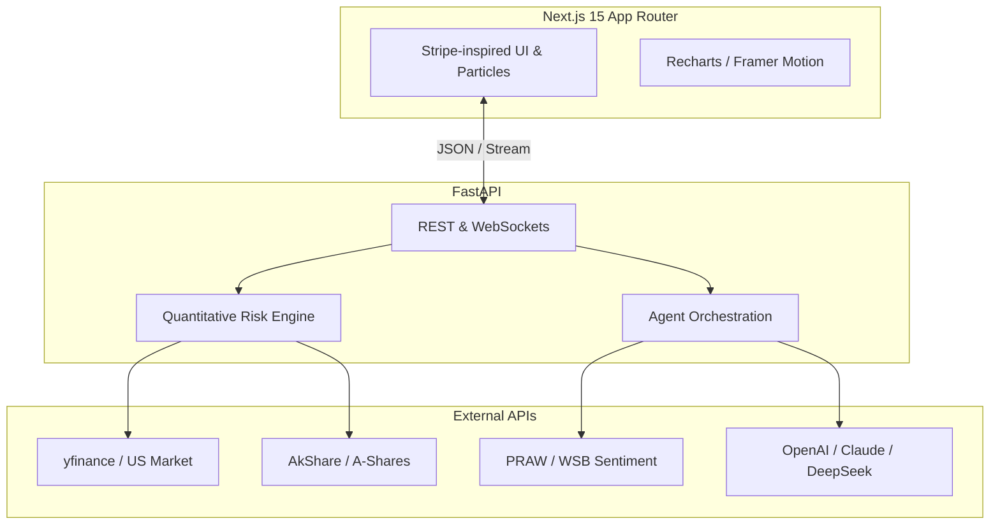

```markdown
# 📈 fin-agent-pro

> **AI-Powered Financial Intelligence & Risk Detection Platform.**
> Engineered with Next.js 15, FastAPI, and Multi-Agent LLMs (Claude/DeepSeek) for US & China A-Shares.

[](https://nextjs.org/)
[](https://fastapi.tiangolo.com/)
[](https://opensource.org/licenses/MIT)

*Live Demo: [finagent.ai](https://your-live-demo-link.com) (Coming Soon)*

---

## 🚀 Overview

`fin-agent-pro` is not just another stock ticker app. It is a full-stack, AI-driven financial analysis tool designed to uncover market alpha and detect financial red flags. By combining traditional quantitative models (Altman Z-Score, Beneish M-Score) with advanced LLM reasoning, it provides institutional-grade insights for retail investors and researchers.


## ✨ Core Features

* 🛡️ **Financial Fraud Detection:** Automated calculation of **Altman Z-Score** (Bankruptcy risk) and **Beneish M-Score** (Earnings manipulation).
* 🗺️ **Real-time Market Heatmap:** Visualizes sector attention and volatility across US and China A-Shares.
* 🤖 **Multi-Agent AI Insights:** Orchestrates DeepSeek (for A-Shares context) and Claude (for complex reporting) to generate readable financial summaries.
* 📊 **Multi-Entity Comparison:** Side-by-side fundamental analysis with interactive Recharts.
* 📄 **One-Click PDF Reports:** Instantly generate and export professional research reports.

## 🏗️ Architecture



## 💻 Tech Stack

* **Frontend:** Next.js 15, React 19, TypeScript, Tailwind CSS v4, Framer Motion, Recharts.
* **Backend:** Python 3.11+, FastAPI, Pydantic, yfinance, AkShare, PRAW.
* **AI & NLP:** LangChain, Anthropic Claude 3.5, DeepSeek-Coder.
* **Deployment:** Vercel (Frontend) + Render/Railway (Backend).

## 🗺️ Roadmap (2024-2025)

- [x] **Phase 1: Foundation & Quant Models**
  - [x] Next.js + FastAPI dual-repo setup.
  - [x] Altman & Beneish model implementation.
  - [x] Multi-company data fetching (US & A-Shares).
- [ ] **Phase 2: Advanced Analysis & Valuation** (WIP)
  - [ ] **DCF Valuation Calculator:** Interactive Discounted Cash Flow modeling with adjustable WACC and terminal growth rates.
  - [ ] **Social Sentiment Alpha:** Reddit `r/wallstreetbets` data scraping via PRAW with Domain Knowledge Chain-of-Thought (DK-CoT) filtering.
- [ ] **Phase 3: UX & Performance**
  - [ ] Implement Stripe-inspired interactive particle background (WebGL/Canvas).
  - [ ] Redis caching for high-frequency ticker queries.
  - [ ] Comprehensive test coverage (Jest + Pytest).

## 🛠️ Getting Started

### Prerequisites
* Node.js 18+
* Python 3.11+
* Reddit API Credentials (for Sentiment Analysis)
* OpenAI/Anthropic/DeepSeek API Keys

### Installation

1. **Clone the repository:**
   ```bash
   git clone [https://github.com/YourUsername/fin-agent-pro.git](https://github.com/YourUsername/fin-agent-pro.git)
   cd fin-agent-pro
   ```

2. **Setup Backend (FastAPI):**
   ```bash
   cd backend
   python -m venv venv
   source venv/bin/activate  # On Windows use `venv\Scripts\activate`
   pip install -r requirements.txt
   
   # Setup environment variables
   cp .env.example .env 
   # Add your API keys to the .env file
   
   uvicorn api:app --reload --port 8000
   ```

3. **Setup Frontend (Next.js):**
   ```bash
   cd ../frontend
   npm install
   npm run dev
   ```
   *Navigate to `http://localhost:3000` to view the app.*

## ⚖️ Disclaimer

**Not Financial Advice.** This project is for educational and research purposes only. The quantitative models, AI-generated summaries, and sentiment scores do not constitute investment advice. Always conduct your own due diligence before making financial decisions.

## 📄 License

Distributed under the MIT License. See `LICENSE` for more information.
```
